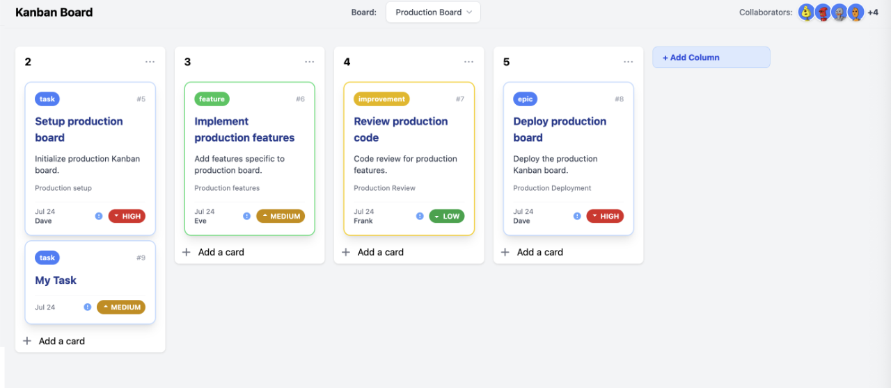

[](LICENSE)
[](https://astro.build/)
[](https://vuejs.org/)
[](https://tailwindcss.com/)

# Astro Kanban Board

Astro Kanban Board is a modern, collaborative Kanban board built with Astro, Vue.js, and TailwindCSS. It allows users to manage tasks, columns, and collaborators in a visually appealing and highly interactive interface. Features include drag-and-drop, customizable task types, avatars, and more.

## Features

- **Multiple Kanban boards** with a board selector
- Drag-and-drop tasks and columns (per board)
- Customizable task types and priorities
- Collaborator avatars
- Responsive design
- Easy to extend and maintain

## What's New

- Multi-board support: Create and manage multiple Kanban boards
- Board selector in the navbar for switching between boards
- Tasks and columns are always separated by board
- Drag-and-drop and add column/task features are board-aware
- Improved type safety and backend validation

## Getting Started

### Prerequisites

- Node.js (v18 or higher recommended)
- pnpm (or npm/yarn)

### Installation

```bash
pnpm install
```

### Running the Project

```bash
pnpm run dev
```

Then open [http://localhost:3000](http://localhost:3000) in your browser.

### Building for Production

```bash
pnpm run build
```

## How to Collaborate

1. Fork the repository and clone your fork.
2. Create a new branch for your feature or fix:

   ```bash
   git checkout -b feature/my-feature
   ```

3. Make your changes and commit them with clear messages.
4. Push your branch to your fork:

   ```bash
   git push origin feature/my-feature
   ```

5. Open a Pull Request to the main repository.
6. Ensure your code follows the DRY and KISS principles and is well documented.

## Contributing Guidelines

- Use clear, descriptive commit messages.
- Keep components clean and simple.
- Add or update documentation as needed.
- Respect code style and formatting.

## License

This project is licensed under the MIT License.
